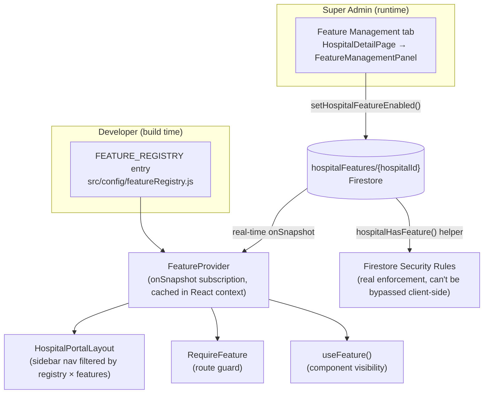

# New Module Development Guide

**Audience:** every developer adding a module (a page/feature area) to the hospital staff portal (`/dashboard`).
**Status:** standard, mandatory process for this project.
**Companion reading:** `src/config/featureRegistry.js` (the registry itself), `firestore.rules`.

---

## 1. Why this exists

This is a multi-tenant SaaS: many hospitals share one codebase and one Firebase project, but each
hospital gets its own set of enabled modules, decided by the Super Admin — not by what's deployed.
Shipping a new module (e.g. a Chatbot) must never turn it on for every hospital automatically.

The system that makes this possible has three moving parts:

| Concept | What it is | Who owns it | Where it lives |
|---|---|---|---|
| **Feature Registry** | The catalog of every module that exists in the code | Developers, via a PR | `src/config/featureRegistry.js` (code) |
| **Hospital Feature Mapping** | Which of those modules a *specific hospital* may use | Super Admin, at runtime | `hospitalFeatures/{hospitalId}` (Firestore) |
| **Feature Gate** | The code that reads both and decides "show it / block it" | Nobody — it's generic, written once | `FeatureContext`, `RequireFeature`, `useFeature`, Firestore rules |

**The rule that makes this scale:** a new module is *one registry entry* + the same handful of
already-existing generic files wired to it. You never touch the registry-consuming code
(`HospitalPortalLayout`, `FeatureManagementPanel`, Firestore's `hospitalFeatures` rule) — those are
written once, generically, in this guide, and stay untouched forever.

---

## 2. Architecture overview

This app is a Firebase-only SPA (React + Firestore + Firebase Auth, no custom Node/Express
backend — see `package.json`). "Backend" and "middleware" in this project mean **Firestore
Security Rules**, not server middleware. Keep that in mind throughout — it changes where
enforcement actually happens.



Two independent enforcement layers, always both present:

1. **Client-side (UX only):** `FeatureContext` + `RequireFeature` + `useFeature` decide what
   renders — nav items, routes, buttons. This is for user experience, not security.
2. **Server-side (real security):** Firestore Security Rules, using the `hospitalHasFeature()`
   rule helper, decide what Firestore will actually read/write. A user editing the client bundle
   or calling the Firestore SDK directly cannot get past this layer. **Every module whose data
   needs protecting must have its own rule that calls `hospitalHasFeature()`** — see §7.

---

## 3. Database schema

### 3.1 Feature Registry (code, not Firestore)

`src/config/featureRegistry.js` exports `FEATURE_REGISTRY`, an array of:

```js
{
  key: 'chatbot',            // stable id — Firestore field name, route segment, nav key. Never rename once shipped.
  label: 'Chatbot',          // human-readable, shown in nav and in the Super Admin toggle list
  description: '...',        // shown under the label in the Super Admin toggle list
  icon: 'chat',               // must exist in src/components/common/NavIcon.jsx PATHS
  path: 'chatbot',            // route segment under /dashboard
  allowedRoles: [ROLES.HOSPITAL_ADMIN, ROLES.RECEPTIONIST], // who may see it, independent of the feature flag
  category: FEATURE_CATEGORIES.ENGAGEMENT,
  isCore: false,              // true = every hospital always has it, not shown as a toggle
  defaultEnabled: false,      // only meaningful when isCore is false
}
```

This is a **code file, not a database table**, because a module can't be "used" until its page,
route and nav entry are deployed anyway — there is no scenario where the registry changes without
a deploy. Keeping one source of truth here (instead of also mirroring it into Firestore) avoids
two catalogs drifting apart.

### 3.2 Hospital Feature Mapping (Firestore)

Collection: **`hospitalFeatures`**, one document per hospital, doc ID == hospital slug (same ID
used in the `hospitals` collection).

```json
// hospitalFeatures/abc
{
  "hospitalId": "abc",
  "features": {
    "chatbot": false,
    "laboratory": true
  },
  "updatedAt": <server timestamp>,
  "updatedBy": "superadmin@example.com"
}
```

Notes:

- Only **non-core** keys ever appear here. Core modules (`overview`, `appointments`, `patients`,
  `staff`, `doctors`, `schedule`) are never written to this doc — `isFeatureEnabled()` treats
  `isCore` entries as always-on regardless of what's stored.
- A hospital doc is created lazily: `setHospitalFeatureEnabled` does an upsert, so a hospital that
  has never had a module toggled simply has no `hospitalFeatures` doc, and every non-core feature
  correctly reads as `false` via the registry's `defaultEnabled` default (see
  `src/firebase/hospitalFeatures.js`'s `withDefaults()`).
- This is deliberately a **separate top-level collection**, not a `features` map bolted onto the
  `hospitals` doc (which already holds branding/content — see `optionals` in
  `src/firebase/hospitals.js`). Keeping it separate means: a Super Admin editing branding can't
  accidentally clobber feature flags in the same write, and the Firestore rule for it can stay
  tight (§7) independent of the broader `hospitals` rule.
- One flat boolean map, not one document per feature. At "hundreds of hospitals × hundreds of
  modules" scale this is still a tiny document (a few hundred booleans, nowhere near Firestore's
  1 MiB limit) and — critically — it's **one read** to get every flag for a hospital, which is
  what makes the caching strategy in §5 cheap.

### 3.3 Why not a table per hospital-feature pair?

A normalized `hospitalId + featureKey → enabled` row-per-pair model (SQL instinct) would cost one
query per feature check or a `whereIn` fan-out, and Firestore bills and rate-limits per document
read. The flat-map model costs exactly one document read per hospital session, cached for the
whole session (§5). If you later need per-feature metadata (enabled-at timestamps, per-feature
plan-tier gating, config blobs), extend the map's values from `boolean` to an object — see §10 for
the migration shape — rather than switching to per-document rows.

---

## 4. Backend architecture (Firestore rules as middleware)

There is no Express-style middleware chain in this project — Firestore Security Rules are the
authorization layer, evaluated by Firestore itself on every read/write, and they cannot be
bypassed by the client. Relevant rules live in `firestore.rules`:

```js
// Reusable guard for any collection that belongs to an optional module.
function hospitalHasFeature(hospitalId, featureKey) {
  return exists(/databases/$(database)/documents/hospitalFeatures/$(hospitalId)) &&
    get(/databases/$(database)/documents/hospitalFeatures/$(hospitalId)).data.features[featureKey] == true;
}

// The hospitalFeatures doc itself: staff may read their own hospital's
// flags; only the Super Admin may ever write them.
match /hospitalFeatures/{hospitalId} {
  allow get: if isSuperAdmin() || isHospitalStaffOf(hospitalId);
  allow list: if isSuperAdmin();
  allow create, update, delete: if isSuperAdmin();
}
```

**Authorization strategy:** two independent checks are ANDed together for any module's data,
mirroring the existing pattern for roles:

- *Is this user staff of this hospital, with the right role?* → `isHospitalStaffOf()` /
  `isHospitalAdminOf()` (existing helpers).
- *Does this hospital have this module enabled?* → `hospitalHasFeature()` (new helper, §7 shows
  it applied to a module's own collection).

**API flow** for a Firestore-only module (most modules): Component → `src/firebase/<module>.js`
accessor function → Firestore SDK call → Security Rules evaluate → allowed/denied. There is no
separate "API layer" to expose; the accessor file *is* the API (see §8).

**API flow for a module needing trusted server compute** (e.g. Chatbot calling a paid LLM API key
that must never reach the client): this repo has no Cloud Functions yet (no `functions/` in
`firebase.json`). When a module needs one, add it with `firebase init functions` and guard every
callable at the top, same idea as the Firestore rule:

```js
// functions/src/assertFeatureEnabled.js
const admin = require('firebase-admin')

async function assertFeatureEnabled(hospitalId, featureKey) {
  const snap = await admin.firestore().doc(`hospitalFeatures/${hospitalId}`).get()
  if (!snap.exists || snap.data().features?.[featureKey] !== true) {
    throw new functions.https.HttpsError('permission-denied', `${featureKey} is not enabled for this hospital.`)
  }
}

// functions/src/chatbot.js
exports.chatbotReply = functions.https.onCall(async (data, context) => {
  if (!context.auth) throw new functions.https.HttpsError('unauthenticated', 'Sign in required.')
  await assertFeatureEnabled(data.hospitalId, 'chatbot')
  // ... call the LLM, never expose its API key to the client ...
})
```

This is the same three-line shape every future server-side module reuses — write it once when the
first module needs it, then copy the guard call, not the implementation.

---

## 5. Caching & performance strategy

Goal: **never** re-query Firestore for feature flags on every render or every route change.

- `FeatureProvider` (`src/contexts/FeatureContext.jsx`) opens **one** `onSnapshot` listener per
  authenticated session, scoped to the current hospital's `hospitalFeatures` doc, right after
  `RequireHospitalStaff` resolves `hospitalId`. Every component that needs a flag reads it from
  React context (`useFeatures()` / `useFeature()`) — zero additional Firestore reads.
- **Refresh strategy:** real-time, not polling. `onSnapshot` pushes the new document the instant
  the Super Admin flips a toggle — a hospital admin's sidebar updates live, no refresh needed, no
  stale-cache window to reason about.
- **Cost:** one extra document read per staff login session (comparable to the existing
  `subscribeHospital` read for branding), and zero additional reads thereafter for that session,
  regardless of how many feature checks the UI makes.
- Firestore rules (`hospitalHasFeature()`) add one extra document `get()` per rule evaluation for
  a feature-gated collection — normal Firestore rule cost, no different from the existing
  `isHospitalStaffOf()` pattern that already does a `get()` on `users/{uid}`.

---

## 6. Frontend architecture

### 6.1 How the frontend determines available modules

`FEATURE_REGISTRY.filter(f => f.allowedRoles.includes(role) && isFeatureEnabled(f.key))` — see
`HospitalPortalLayout.jsx`. Two independent filters, always both applied:

- **Role** — is this *type of staff* allowed to use this module at all, anywhere?
- **Feature flag** — has *this hospital* been given this module by the Super Admin?

### 6.2 Route protection

Compose guards the same way roles already compose in `App.jsx`:

```jsx
<Route element={<RequireRole allowedRoles={[ROLES.HOSPITAL_ADMIN, ROLES.RECEPTIONIST]} />}>
  <Route element={<RequireFeature featureKey="chatbot" />}>
    <Route path="chatbot" element={<ChatbotPage />} />
  </Route>
</Route>
```

`RequireFeature` (`src/components/hospitalAdmin/RequireFeature.jsx`) redirects to
`/dashboard/overview` if the flag is off — identical shape to `RequireRole`/`RequireHospitalStaff`,
so it reads like every other guard in the codebase.

### 6.3 Menu generation

`HospitalPortalLayout` no longer hardcodes a per-role nav array. It derives the sidebar directly
from the registry (see §2 diagram) — adding a registry entry is the *only* step needed to make a
module appear in the sidebar for the right roles and hospitals.

### 6.4 Component-level visibility

For a button/section inside an already-reachable page (e.g. hide a "Chat with AI" button on the
Overview page unless chatbot is enabled), use the hook instead of a route guard:

```jsx
import { useFeature } from '../../hooks/useFeature'

function SomeWidget() {
  const { enabled } = useFeature('chatbot')
  if (!enabled) return null
  return <ChatLauncherButton />
}
```

---

## 7. API examples

This project's "API" is its `src/firebase/*.js` accessor modules — plain functions wrapping the
Firestore SDK, called directly from components (no REST layer). The feature module's is
`src/firebase/hospitalFeatures.js`:

**Get a hospital's features (one-time read):**
```js
import { getHospitalFeatures } from '../firebase/hospitalFeatures'
const features = await getHospitalFeatures('abc')
// { chatbot: false, laboratory: true, ... } — every non-core key defaulted, never undefined
```

**Subscribe to a hospital's features (real-time, what the app actually uses):**
```js
import { subscribeToHospitalFeatures } from '../firebase/hospitalFeatures'
const unsubscribe = subscribeToHospitalFeatures('abc', (features) => { /* ... */ })
```

**Enable a feature (Super Admin only — enforced by Firestore rules, not just UI):**
```js
import { setHospitalFeatureEnabled } from '../firebase/hospitalFeatures'
await setHospitalFeatureEnabled('bcd', 'chatbot', true, currentUser.email)
```

**Disable a feature:**
```js
await setHospitalFeatureEnabled('abc', 'chatbot', false, currentUser.email)
```

**Check feature access (what every gate above calls under the hood):**
```js
import { isFeatureEnabled } from '../firebase/hospitalFeatures'
isFeatureEnabled(features, 'chatbot') // -> true/false; always true for isCore keys
```

**Protecting a module's own Firestore collection** (only needed once a module has its own data —
Chatbot doesn't yet, so this is illustrative for the *next* module that does):
```js
// firestore.rules
match /chatbotThreads/{threadId} {
  allow read, write: if isHospitalStaffOf(resource.data.hospitalId) &&
    hospitalHasFeature(resource.data.hospitalId, 'chatbot');
}
```

---

## 8. Security considerations

- **Never trust the client for authorization.** `RequireFeature`/`useFeature` control what
  *renders*; they do not protect data. Every collection a module introduces must add
  `hospitalHasFeature()` to its own Firestore rule (§7). If a module only reads/writes collections
  that already have hospital-scoped rules (e.g. it just uses `appointments`), you still don't get
  feature-level protection for free — add it explicitly if the module's use of that data should be
  feature-gated.
- **Prevent unauthorized API access:** there is no bespoke API to secure beyond Firestore itself —
  the default-deny catch-all (`match /{document=**} { allow read, write: if false }`) at the bottom
  of `firestore.rules` means any collection you forget to add a rule for is unreachable, not
  wide-open. Keep new rules above that line.
- **Prevent UI manipulation:** a user can disable JavaScript checks, edit local storage, or call
  the Firestore SDK from the browser console directly. This is exactly why §8's rule requirement
  is not optional — assume every client-side gate will be bypassed and verify the Firestore rule
  independently (see §11's emulator test suggestion).
- **Writes to `hospitalFeatures` are Super-Admin-only**, enforced in rules, not just hidden in the
  UI — a hospital admin account cannot enable modules for their own hospital even by calling the
  SDK directly.
- **Server-side validation for anything with secrets** (paid third-party APIs, etc.) must go
  through a Cloud Function guarded by `assertFeatureEnabled()` (§4) — never call a
  secret-bearing third-party API directly from the client.

---

## 9. Scalability

- **Hundreds of hospitals:** cost is O(1) Firestore reads per staff session regardless of hospital
  count — no collection scan ever happens to resolve one hospital's flags.
- **Hundreds of modules:** each is one boolean in one map field; a few hundred keys is a trivial
  document size. Adding module #301 costs the same one document read as module #3.
- **Minimal code change per new module:** exactly one new `FEATURE_REGISTRY` entry, one page
  component, one route line, and (only if the module has its own data) one Firestore rule block.
  `HospitalPortalLayout`, `FeatureManagementPanel`, `RequireFeature`, `FeatureContext`, and the
  `hospitalFeatures` Firestore rule are never touched again after this guide's setup — that
  genericity is the entire point of the registry pattern.
- **Cross-hospital analytics** (e.g. "which hospitals have Chatbot enabled," for GTM/billing
  later): `features.<key>` is a normal indexed field path, so
  `query(collection(db, 'hospitalFeatures'), where('features.chatbot', '==', true))` works without
  a custom index.

---

## 10. Folder structure & naming conventions

```
src/
  config/
    featureRegistry.js          # THE catalog — add your module's entry here
  firebase/
    hospitalFeatures.js         # Firestore accessors for the mapping (rarely touched)
    <module>.js                 # only if your module has its own data collection(s)
  contexts/
    FeatureContext.jsx          # generic — do not touch when adding a module
  hooks/
    useFeature.js                # generic — do not touch when adding a module
  components/
    hospitalAdmin/
      RequireFeature.jsx         # generic route guard — do not touch when adding a module
    superadmin/
      FeatureManagementPanel.jsx # generic Super Admin toggle UI — do not touch when adding a module
  pages/
    hospitalAdmin/
      <Module>Page.jsx          # your new page
firestore.rules                  # add a rule block only if your module has its own collection(s)
```

**Naming conventions:**
- Registry `key`: `lowerCamelCase`, matches the Firestore map key and the route path segment
  exactly (e.g. `chatbot`). Treat it as a permanent identifier — never rename once any hospital
  has it stored.
- `label`: Title Case, human-facing (nav text and Super Admin toggle list).
- Page component: `<PascalCase module name>Page.jsx` (e.g. `ChatbotPage.jsx`), in
  `src/pages/hospitalAdmin/`.
- Firestore collections for module-owned data: `camelCase`, plural (e.g. `chatbotThreads`),
  consistent with existing collections (`patients`, `doctorSlots`, `phoneDailyCounts`).
- Icons: add the SVG path to `PATHS` in `src/components/common/NavIcon.jsx` under the same key
  you reference in the registry's `icon` field — `NavIcon` silently renders nothing for an unknown
  name, so a typo here is a silent missing-icon bug, not a crash. Double check it visually.

---

## 11. How to add a new module — mandatory checklist

1. **Register it.** Add an entry to `FEATURE_REGISTRY` in `src/config/featureRegistry.js`:
   `key`, `label`, `description`, `icon`, `path`, `allowedRoles`, `category`, `isCore: false`,
   `defaultEnabled: false`.
2. **Add the icon** to `NavIcon.jsx` if `icon` isn't already a key there.
3. **Build the page** at `src/pages/hospitalAdmin/<Module>Page.jsx`.
4. **Add the data layer**, if the module has its own data: `src/firebase/<module>.js` following the
   existing `subscribeX` / `getX` / `createX` / `updateX` pattern used by `firebase/patients.js`,
   `firebase/appointments.js`, etc.
5. **Add the Firestore rule**, if the module has its own collection(s): a rule block using
   `isHospitalStaffOf()` AND `hospitalHasFeature(hospitalId, '<key>')`, above the catch-all deny
   rule (§7 shows the shape).
6. **Wire the route** in `App.jsx`, inside the `/dashboard` subtree, composed from
   `RequireRole` (if role-restricted) and `RequireFeature featureKey="<key>"`:
   ```jsx
   <Route element={<RequireRole allowedRoles={[...]} />}>
     <Route element={<RequireFeature featureKey="<key>" />}>
       <Route path="<path>" element={<YourModulePage />} />
     </Route>
   </Route>
   ```
7. **Do not touch** `HospitalPortalLayout.jsx`'s nav logic, `FeatureManagementPanel.jsx`, or
   `FeatureContext.jsx` — the registry entry from step 1 makes your module appear in both the
   sidebar and the Super Admin toggle list automatically.
8. **Run the testing checklist** (§12) before opening a PR.

That's it — no other file needs to know your module exists.

---

## 12. Testing checklist before merging

- [ ] New registry entry has a unique `key` not reused by any existing entry.
- [ ] With the feature **off** for a test hospital: nav item is absent, and navigating to the
      route directly (typed URL) redirects to `/dashboard/overview` instead of rendering the page.
- [ ] With the feature **on**: nav item appears only for the `allowedRoles` you declared, and the
      route renders.
- [ ] Toggling the feature in the Super Admin "Modules" tab updates the hospital portal **live**
      (no page refresh) — confirms the `onSnapshot` wiring, not a stale read.
- [ ] A **second** hospital with the feature left off is unaffected (isolation across tenants).
- [ ] If the module added a Firestore collection: run the Firestore emulator
      (`firebase emulators:start` — already configured in `firebase.json`) and confirm a direct
      SDK write from a disabled hospital is rejected by the rule, not just hidden by the UI.
- [ ] Existing core modules (Overview, Appointments, Patients, Staff, Doctors, My Schedule) are
      unaffected for every role.
- [ ] `npm run build` succeeds with no new warnings.

---

## 13. Common mistakes to avoid

- **Hardcoding a nav item** instead of adding a registry entry — defeats the entire system and
  will not respect the Super Admin's toggle.
- **Assuming client-side gating is security.** Skipping the Firestore rule for a module's own
  collection because "the button is hidden anyway" — it isn't security until the rule exists.
- **Marking a module `isCore: true`** to skip building the toggle UX — only the six modules that
  ship with every hospital by definition (`overview`, `appointments`, `patients`, `staff`,
  `doctors`, `schedule`) should ever be core.
- **Storing core features in `hospitalFeatures`.** They're implicitly always-on; don't write them
  to the map, and don't gate their routes with `RequireFeature`.
- **Forgetting `defaultEnabled: false`** — new modules must default OFF for every existing
  hospital the instant they ship, per this project's whole premise ("a new module should not
  automatically become available to every hospital").
- **Reusing another module's `key`** or renaming one after hospitals have it stored — the stored
  Firestore field becomes orphaned and the toggle breaks silently.
- **Bypassing `useFeatures()`/`useFeature()`** and reading `hospitalFeatures` from Firestore
  directly inside a component — re-fetches instead of using the cached session subscription (§5)
  and duplicates logic that already lives in `isFeatureEnabled()`.

---

## 14. Coding standards recap

- Route guards are tiny, dependency-free components that render `<Outlet />` or redirect — see
  `RequireRole`, `RequireHospitalStaff`, `RequireFeature` for the exact shape to copy.
- Firestore accessor files (`src/firebase/*.js`) export plain async/subscribe functions, no
  classes, following `subscribeX(id, callback) -> unsubscribe`, `getX(id) -> Promise`,
  `createX(...)`, `updateX(id, patch)` — see `firebase/hospitals.js`, `firebase/hospitalFeatures.js`.
- Contexts export both the `Provider` and a `useXxx()` hook from the same file, and the hook
  throws if used outside its provider — see `AuthContext.jsx`, `FeatureContext.jsx`.
- Comments explain *why*, not *what* — write one only where a constraint or gotcha isn't obvious
  from the code itself (the existing codebase's style throughout `firebase/`, `firestore.rules`).

---

## 15. Worked example: the Chatbot module

This module is already wired end-to-end in this codebase as the reference implementation —
read the files, don't just read this section:

| Step | File |
|---|---|
| Registry entry | `src/config/featureRegistry.js` — `key: 'chatbot'`, `isCore: false`, `defaultEnabled: false` |
| Page | `src/pages/hospitalAdmin/ChatbotPage.jsx` |
| Route | `src/App.jsx` — `RequireRole` → `RequireFeature featureKey="chatbot"` → `<Route path="chatbot" .../>` |
| Nav | Automatic — `HospitalPortalLayout.jsx` derives it from the registry, no chatbot-specific code |
| Super Admin toggle | Automatic — `FeatureManagementPanel.jsx` renders it as a row, no chatbot-specific code |
| Data layer | Not yet built — Chatbot has no Firestore collection of its own yet. When it does
  (e.g. `chatbotThreads`), follow §7's rule pattern with `hospitalHasFeature(hospitalId, 'chatbot')` |
| Server compute | Not yet built — when Chatbot calls an LLM, add a Cloud Function guarded by
  `assertFeatureEnabled()` per §4, so the API key never reaches the client |

Try it: as Super Admin, open a hospital's **Modules** tab and switch Chatbot **ON**. Log in as
that hospital's admin or receptionist — the Chatbot link appears in the sidebar and `/dashboard/chatbot`
loads. Switch it back **OFF** — the link disappears and the route redirects, live, without a
refresh. A second hospital with Chatbot left off never sees it. This is the exact behavior every
future module gets by following §11.
